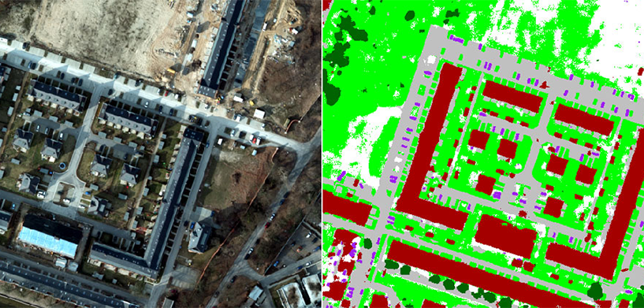

## (CC8122) INTERFACE HUMANO-COMPUTADOR: PROJETO GEOSEGMENT

  

Este repositório contém o projeto desenvolvido no contexto da disciplina **Interface Humano-Computador (IHC)**, vinculado ao **Trabalho de Conclusão de Curso (TCC)**.

O projeto tem como objetivo aplicar conceitos de **usabilidade**, **experiência do usuário (UX)** e **design de interação**, com foco no desenvolvimento de soluções centradas no usuário e alinhadas às boas práticas de Engenharia de Software.

## Entregas

| Tópico | Descrição | Acesso |
|--------|----------|--------|
| **Tópico 01** | Caracterização do Projeto Interface | [Visualizar](Tópico%2001%20-%20Caracterização%20do%20Projeto%20Interface.md) |
| **Tópico 02** | Análise de concorrência | [Visualizar](Tópico%2002%20-%20Análise%20de%20concorrência.md) |
| **Tópico 03** | Personas e Perfil do usuário | [Visualizar](Tópico%2003%20-%20Usuários.md) |
| **Tópico 04** | Cenário de Análise de Problemas | [Visualizar](Tópico%2004%20-%20Cenário%20de%20Análise%20de%20Problemas.md) |
| **Tópico 5** | Modelos de tarefas (HTA) | [Visualizar HTA](Tópico%2005%20-%20Análise%20Hierárquica%20de%20Tarefas%20(HTA).md) |
| **Tópico 5** | Modelos de tarefas (GOMS) | [Visualizar GOMS](Tópico%2005%20-%20GOMS.md) |
| **Tópico 5** | Modelos de tarefas (CTT) | [Visualizar CTT](Tópico%2005%20-%20CTT.md) |
| **Tópico 6** | Abordagens teóricas de IHC (complementar) | X |
| **Tópico 7** | Métodos de Coleta de Dados | [Visualizar](Tópico%2007%20-%20Métodos%20de%20Coleta%20de%20Dados.md) |
| **Tópico 8** | Processos de projeto de IHC | X |
| **Tópico 9** | Modelo conceitual e Esquema de Signos | X |
| **Tópico 10** | MoLIC (modelagem da interação) | X |
| **Tópico 11** | Prototipação da interface (Figma) | [Visualizar](Tópico%2011%20-%20Telas%20Figma.md) |
| **Tópico 12** | Princípios e diretrizes para design / Planejamento da avaliação | X |
| **Tópico 13** | A definir | X |
| **Tópico 14** | A definir | X |

## Membros da Equipe

| Nome | RA |
|------|----|
| Deise Adriana Silva Araújo | 22.222.024-6 |
| Gustavo Dias Vicentin | 22.123.061-8 |
| Lucas Rebouças Silva | 22.122.048-6 |
| Victor Caldeira Iak | 22.122.057-7 |
| Vinicius Saidi Soares | 22.122.064-3 |

## Rastreabilidade: Responsável × R.A. × Funcionalidade × Cenário (Tópico 04)

Cada integrante é responsável por uma grande funcionalidade; cada funcionalidade possui um cenário de análise de problemas no [Tópico 04](Tópico%2004%20-%20Cenário%20de%20Análise%20de%20Problemas.md).

| Responsável | R.A. | Funcionalidade | Cenário (Tópico 04) |
|-------------|------|----------------|---------------------|
| Vinicius Saidi Soares | 22.122.064-3 | Segmentação de imagens (upload) | Cenário 1 – Upload e segmentação |
| Gustavo Dias Vicentin | 22.123.061-8 | Seleção de redes + informações técnicas | Cenário 2 – Seleção de modelo e validação técnica |
| Deise Adriana Silva Araújo | 22.222.024-6 | Insights e dashboards | Cenário 3 – Insights e Dashboard |
| Lucas Rebouças Silva | 22.122.048-6 | Comparação temporal | Cenário 4 – Comparação temporal |
| Victor Caldeira Iak | 22.122.057-7 | Dashboard inicial (Histórico e timeline) | Cenário 5 – Histórico e timeline |

## Instituição

**Centro Universitário FEI**  
**Curso**: Ciência da Computação  
**Disciplina**: CC8122: Interface Humano-Computador
