# Análise Hierárquica de Tarefas (HTA) – GeoSegment

Este documento descreve a Análise Hierárquica de Tarefas (HTA) do projeto **GeoSegment**, relacionando objetivos/operações com problemas e recomendações de usabilidade.

## Diagrama HTA

A estrutura hierárquica das tarefas do sistema é representada no diagrama abaixo:

---
| Objetivos / Operações | Problemas e Recomendações |
|----------------------|---------------------------|
| **0. Analisar uso do solo a partir de imagem aérea (1 > 2 > 3 > 4)** | **Input:** imagem aérea de alta resolução (ex.: 30 cm/px)   **Feedback:** exibição do mapa segmentado e estatísticas por classe   **Plano:** carregar imagem → configurar segmentação → executar processamento → analisar resultados   **Recomendação:** permitir acesso via navegador sem necessidade de softwares especializados |
| **1. Carregar imagem da área de interesse (1.1 > 1.2)** | **Plano:** selecionar arquivo e confirmar upload   **Problema:** arquivos grandes podem gerar lentidão ou falhas   **Recomendação:** exibir barra de progresso e validação automática de formato e resolução |
| **1.1 Selecionar arquivo (.tiff ou .png)** | **Problema:** usuário pode tentar enviar formatos inválidos   **Recomendação:** restringir seleção apenas a formatos compatíveis |
| **1.2 Confirmar upload da imagem** | **Feedback:** pré-visualização da imagem carregada   **Recomendação:** permitir cancelamento ou substituição da imagem |
| **2. Configurar segmentação automática (2.1 > 2.2)** | **Plano:** selecionar modelo de IA e parâmetros de execução   **Problema:** usuários não especialistas podem não compreender termos técnicos   **Recomendação:** fornecer descrições simplificadas e tooltips |
| **2.1 Selecionar modelo de segmentação (V0, V1 ou V2)** | **Problema:** dificuldade em decidir qual modelo utilizar   **Recomendação:** apresentar métricas resumidas e indicação de uso recomendado |
| **2.2 Definir parâmetros de execução** | **Problema:** excesso de opções pode confundir usuários leigos   **Recomendação:** oferecer configurações padrão e modo avançado opcional |
| **3. Executar segmentação automática (depende de 1 e 2)** | **Ação:** iniciar processamento de inferência   **Problema:** tempo de espera elevado pode gerar ansiedade   **Recomendação:** exibir status do processamento e tempo estimado |
| **4. Visualizar resultados da segmentação (4.1 / 4.2)** | **Plano:** visualizar mapas e estatísticas simultaneamente   **Problema:** sobrecarga de informação visual   **Recomendação:** permitir personalização do dashboard |
| **4.1 Analisar estatísticas (4.1.1 / 4.1.2)** | **Problema:** dados numéricos podem ser difíceis de interpretar   **Recomendação:** uso de gráficos e percentuais simplificados |
| **4.1.1 Analisar estatísticas por histórico** | **Problema:** dificuldade em identificar mudanças ao longo do tempo   **Recomendação:** permitir comparação temporal quando disponível |
| **4.1.2 Analisar estatísticas por classe** | **Problema:** interpretação da distribuição das classes   **Recomendação:** destacar proporções por classe de uso do solo |
| **4.2 Visualizar mapas lado a lado** | **Feedback:** mapas coloridos facilitam a interpretação espacial   **Recomendação:** permitir zoom, sincronização e alternância de camadas |

--- 

## HTA – Cenário 4: Comparação Temporal de Resultados (GeoSegment)

O diagrama abaixo apresenta a **Hierarchical Task Analysis (HTA)** da tarefa de comparação temporal entre dois períodos no sistema GeoSegment.

```mermaid
flowchart TB

A["0. Comparar resultados entre dois períodos"]

A --> B["1. Acessar Dashboard"]
B --> B1["1.1 Abrir GeoSegment"]
B --> B2["1.2 Ir para Dashboard"]

A --> C["2. Selecionar períodos"]
C --> C1["2.1 Selecionar período atual"]
C --> C2["2.2 Selecionar período anterior"]
C --> C3["2.3 Confirmar seleção"]

A --> D["3. Ativar comparação temporal"]
D --> D1["3.1 Clicar em 'Comparação Temporal'"]
D --> D2["3.2 Sistema carrega dados"]
D --> D3["3.3 Sistema valida arquivos"]

A --> E["4. Visualizar comparação no mapa"]
E --> E1["4.1 Sobrepor mapas"]
E --> E2["4.2 Destacar áreas alteradas"]
E --> E3["4.3 Exibir cores por classe"]

A --> F["5. Analisar métricas"]
F --> F1["5.1 Visualizar gráficos comparativos"]
F --> F2["5.2 Ver variação percentual"]
F --> F3["5.3 Identificar mudanças"]

A --> G["6. Interpretar resultados"]
G --> G1["6.1 Avaliar aumento urbano"]
G --> G2["6.2 Avaliar perda de vegetação"]
G --> G3["6.3 Verificar confiabilidade"]

A --> H["7. Utilizar resultados"]
H --> H1["7.1 Exportar mapas"]
H --> H2["7.2 Exportar gráficos"]
H --> H3["7.3 Inserir no relatório"]
```

A --> H["7. Utilizar resultados"]
H --> H1["7.1 Exportar mapas"]
H --> H2["7.2 Exportar gráficos"]
H --> H3["7.3 Inserir no relatório"]
