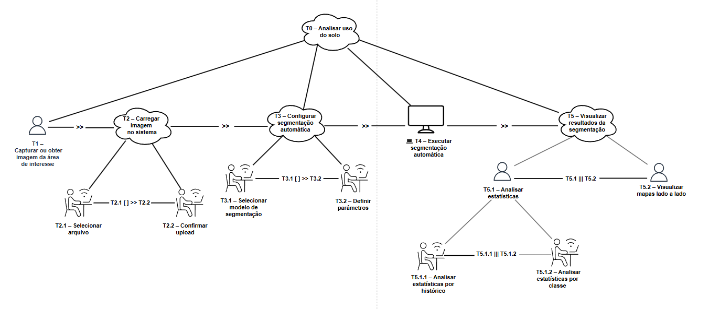
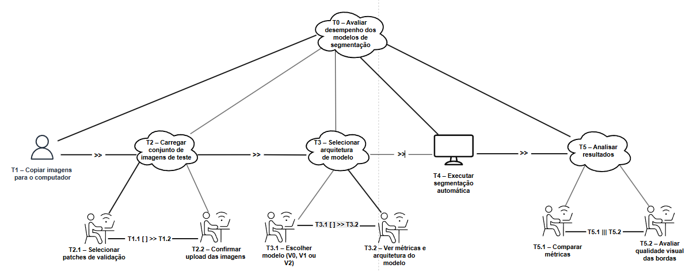
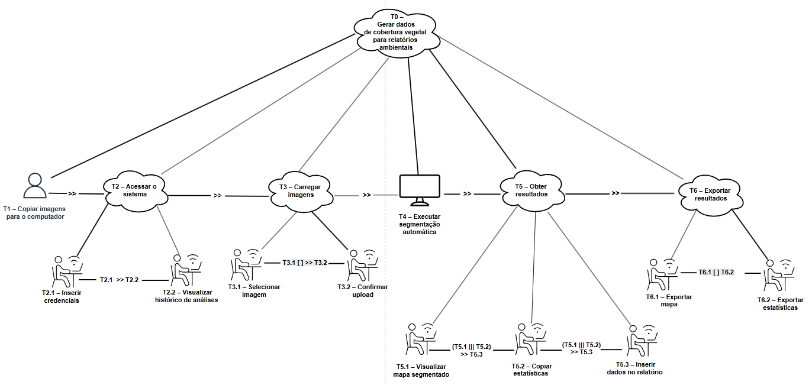
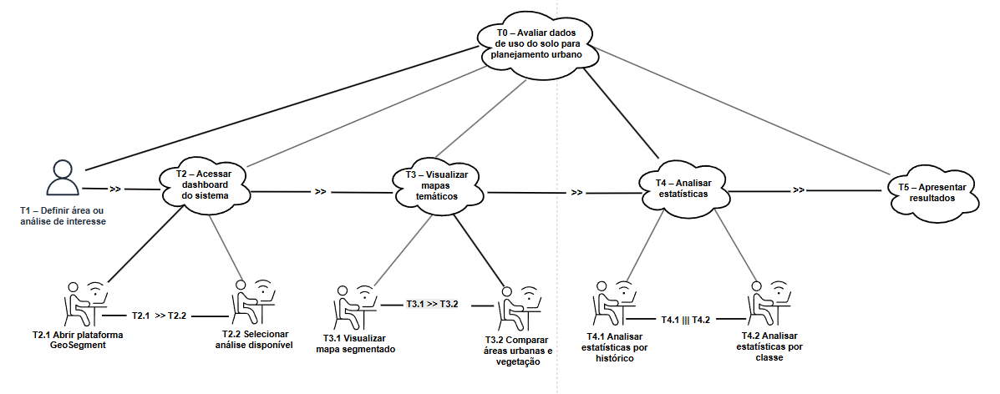
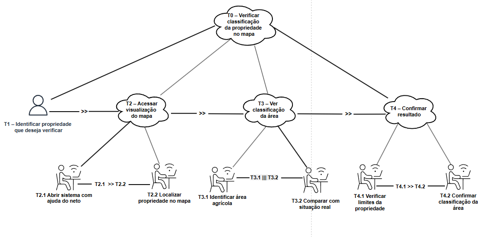

# Modelos CTT – GeoSegment

Este documento reúne os diagramas CTT (ConcurTaskTrees) por persona, correspondentes às HTA do Tópico 05. Os diagramas estão disponíveis em `img/ctt/`.

## Sumário

- [CTT — HTA 1 (Ricardo Mendes)](#ctt--hta-1-ricardo-mendes)
- [CTT — HTA 2 (Dra. Helena Silveira)](#ctt--hta-2-dra-helena-silveira)
- [CTT — HTA 3 (Felipe Antunes)](#ctt--hta-3-felipe-antunes)
- [CTT — HTA 4 (Cláudia Torres)](#ctt--hta-4-cláudia-torres)
- [CTT — HTA 5 (Sr. Benedito)](#ctt--hta-5-sr-benedito)

---

## CTT — HTA 1 (Ricardo Mendes)

Analisar T5.1.1 e T5.1.2 se podem ser feitos ao mesmo tempo. Se não, editar diagrama.

---

## CTT — HTA 2 (Dra. Helena Silveira)

---

## CTT — HTA 3 (Felipe Antunes)

---

## CTT — HTA 4 (Cláudia Torres)

---

## CTT — HTA 5 (Sr. Benedito)

