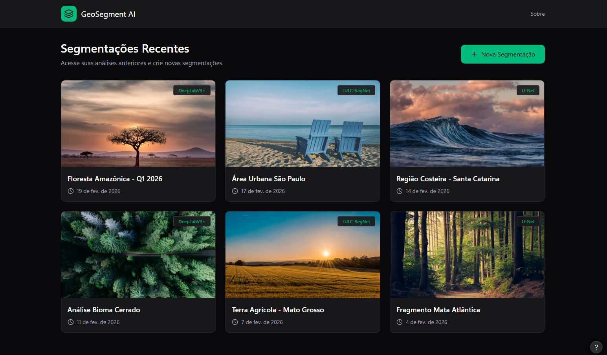
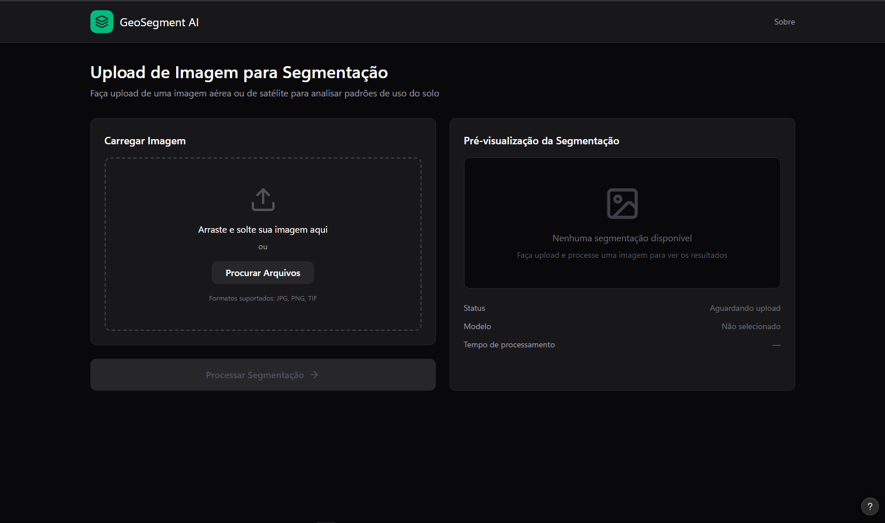
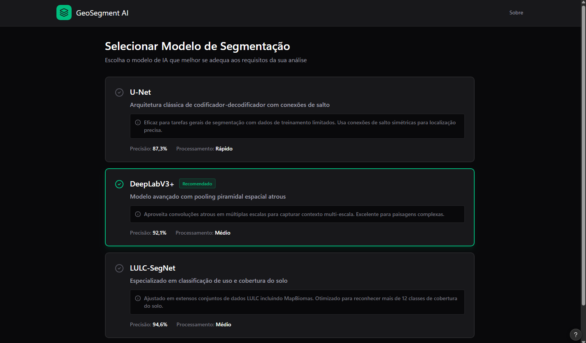
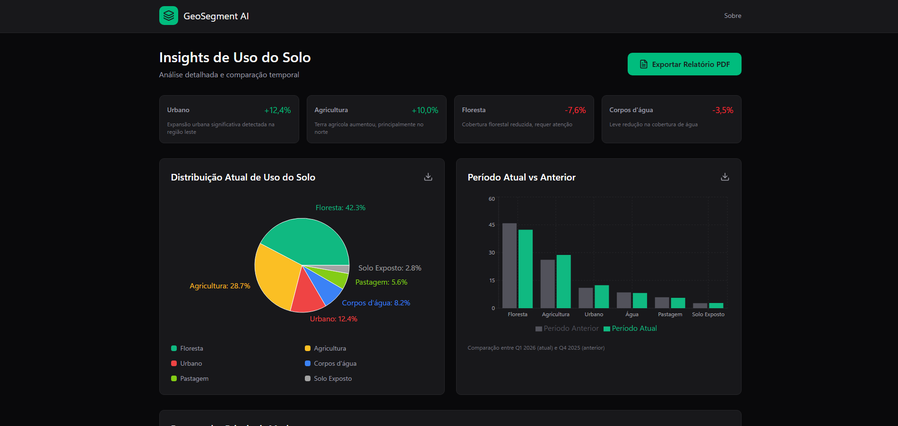

# Telas no Figma – GeoSegment AI

Link para o projeto de telas do GeoSegment AI no Figma (Figma Make):

**[GeoSegment AI – Web App Screens](https://www.figma.com/make/tk7gEbKUrLuOqVWZkam4q1/GeoSegment-AI-Web-App-Screens?t=sALQZCZuFH2M91k4-1)**

- Preview da rota **Model selection**: [Model selection](https://www.figma.com/make/tk7gEbKUrLuOqVWZkam4q1/GeoSegment-AI-Web-App-Screens?t=sALQZCZuFH2M91k4-1&preview-route=%2Fmodel-selection)

Para editar ou ver todas as telas, abra o link no Figma (conta necessária).

---

## Imagens das telas (design)

### Home inicial

### Upload de imagem

### Seleção de rede

### Dashboard

